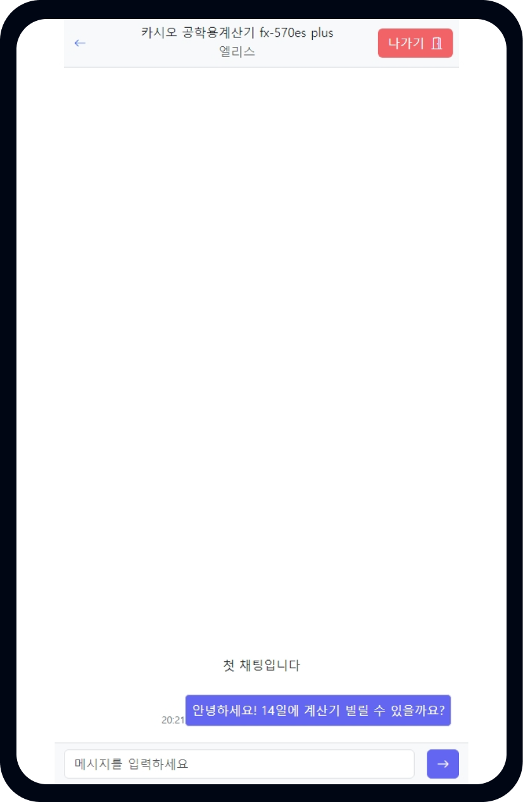

# Team Billage - Frontend

<div align=center></div>
<br/>
<br/>
<br/>

<div align=center><h1>프로젝트 소개</h1></div>

<div align=center></div>

<div align=center><h2>팀원</h2></div>

  <div align=center styles="display:flex; justify-content: space-between">
    
    
    
  </div>
  <div align=center styles="display:flex; justify-content: space-between">
    
    
  </div>

<br/><br/><br/>

<br/>
<br/>
<br/>
<div align=center><h2>📚 STACKS</h2></div>

<div align=center> 
  
  

   
   
  
  

</div>
<br/>
<br/>
<br/>

<div align=center><h2>구현 기능</h2></div>
<div align=center><h3>위치 필터링</h3></div>
<div align=center><h4>사용자의 현재 위치를 바탕으로 데이터를 필터링하여 보여줍니다.</h4></div>
<div align=center styles="display:flex; justify-content: space-between"></div>
<br/>
<br/>
<br/>
<div align=center><h3>실시간 채팅</h3></div>
<div align=center>
<h4>대여 희망자와 대여자 간 채팅을 통하여 가격 합의를 볼 수 있게 하였습니다.</h4>
<h4>새로운 채팅이 올 경우 하단의 채팅 아이콘에 읽지 않은 채팅 개수가 증가합니다.</h4>
</div>
<div align=center styles="display:flex; justify-content: space-between"></div>
<br/>
<br/>
<br/>
<div align=center><h3>예약 시스템</h3></div>
<div align=center>
<h4>대여 희망자와의 채팅 내역을 바탕으로 누구에게 빌려줄 것인지 선택합니다.</h4>
<h4>해당 상품으로 한번이라도 대화한 사람만 불러오고, 가장 최근에 채팅한 사람이 맨 위에 보이게 됩니다.</h4>
</div>
<div align=center styles="display:flex; justify-content: space-between"></div>
<br/>
<br/>
<br/>

<div align=center>
  <h1>시작 가이드</h1>
</div>

<div align=center>
  <h2>Requirements</h2>
  <h4>NodeJS 20.18.0</h4>
</div>
<br/><br/>

<div align=center>
  <h2>Enviromnents</h2>
</div>

```
VITE_AXIOS_BASE_URL={{YOUR_SERVER_BASE_URL}}
```

<br/>
<br/>

<div align=center>
  <h2>Installatioon && Start</h2>
</div>

```
$ git clone ~~~
$ cd ./{CLONED_DIRECTORY_NAME}
$ npm i
$ npm run dev
```
